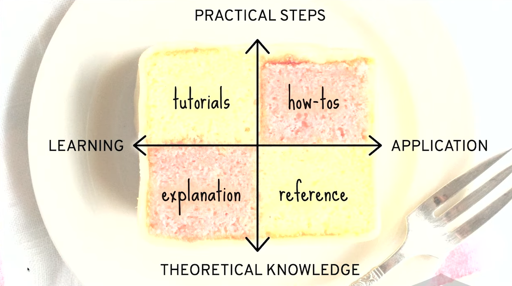

# Introduction

src: https://youtu.be/RwBolXX9Pis?t=455
src: https://diataxis.fr/

:::info
tutorials - [learn.svelte.dev](https://learn.svelte.dev)

how-tos - [https://sveltepatterns.dev](https://sveltepatterns.dev)

explanations - [https://sveltepatterns.dev](https://sveltepatterns.dev)

reference - [https://svelte.dev](https://svelte.dev)
:::

The official docs cover tutorials and API references, but they're light on how-tos and explanations. This site fills that gap with:

- Patterns showing how APIs work together
- Real-world usage patterns
- Expanded examples
- Graphics and cheatsheets
- Gotchas and edge-cases

Some APIs — like `$effect`, `bind:`, and streaming with promises — tend to introduce complexity or unpredictable behaviour. We call out where the complexity lives and when to reach for alternatives.

This is a community project. Found a pattern worth sharing? Contribute and help others build better with **Svelte**.
