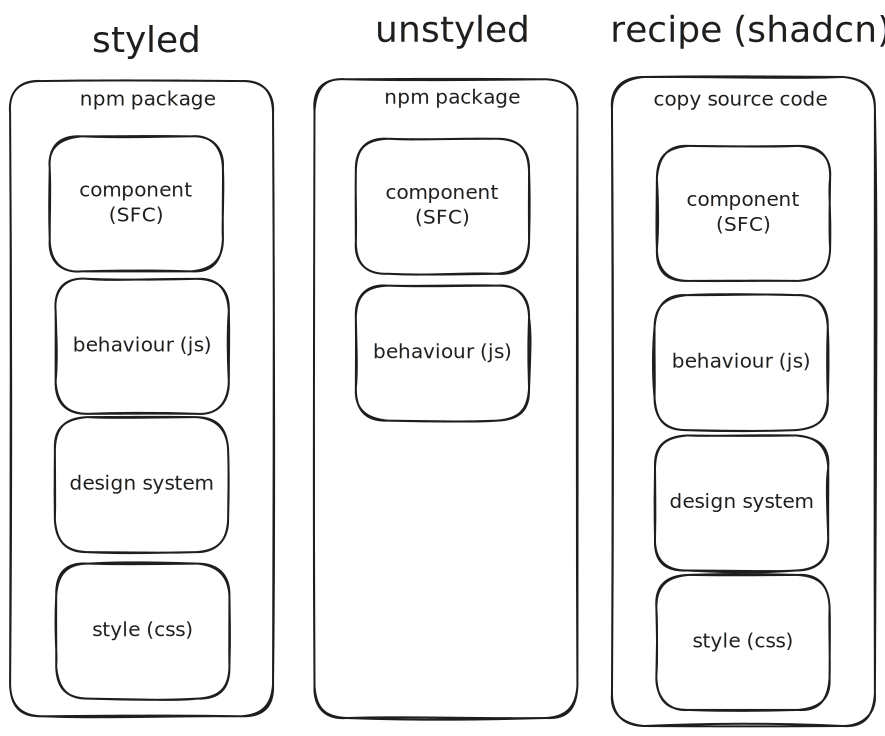

::: info TL;DR
UI libraries range from plug-and-play components to low-level building blocks. Choose based on:

- 🔧 Control (how much design control you want)
- 🚀 Speed (how fast you need to ship)
- 🧠 Skill level (your comfort with CSS and design)
  :::

UI component libraries have gone through many evolutions. This guide breaks down key areas of improvement and the tradeoffs each approach entails.

Note: Libraries often fall into one or more categories, and there is significant cross-pollination (see Shadcn or Base UI). The examples listed below are illustrative, not exhaustive or exclusive.

Another challenge in this space is the overlap in naming conventions. Like Wikipedia, this guide will attempt to disambiguate where necessary.

## Component Types



Component libraries have evolved to support varying levels of flexibility and control, catering to different domain experts—such as designers, front-end developers, and back-end developers—as well as different skill levels. The list below is ordered from most opinionated to least, which generally correlates with ease of use on one end and customizability on the other.

- Want speed and simplicity? → Styled (e.g., MUI, Chakra)
- Want full design control? → Headless (e.g., Radix)
- Want to own everything? → Recipe-based (e.g., Shadcn)

### Styled (Plug & Play)

Not to be confused with [styled-components](https://styled-components.com/), these are plug-and-play UI kits often available as npm packages.


Source: https://youtu.be/CQuTF-bkOgc?t=784

#### Examples

- [MUI](https://mui.com/) (React, Material Design)
- [Vuetify](https://vuetifyjs.com/) (Vue, Material Design)
- [Chakra UI](https://chakra-ui.com/)
- Mantine
- Skeleton UI v2

#### Pros

- Easy to use
- Great for prototyping
- Beginner-friendly
- Minimal CSS knowledge required

#### Cons

- Limited customization
- Tied to a specific framework or library

### Unstyled (Headless)

These libraries let developers control the styling. Their main goal is to provide behavior, accessibility, and cross browser compatibility.

[Web Dev Simplified's intro to unstyled libraries](https://youtu.be/yn6vFCRkC3c)

Because they provide little to no default styling, they may seem incomplete—over time. To address this, many have gradually introduced optional styles or design presets.

#### Via Hook API (JavaScript)

- Melt UI

#### Via Component API (JSX/SFC)

```jsx
import { Input } from '@headlessui/react'

function Example() {
	return <Input type="text" name="full_name" className="border data-[hover]:shadow data-[focus]:bg-blue-100" />
}
```

- [Radix UI](https://www.radix-ui.com/)
- [Headless UI](https://headlessui.com/)
- [React Aria](https://react-spectrum.adobe.com/)
- Bits UI

#### Pros

- Ideal for teams with a design system
- Full control over appearance

#### Cons

- Smaller component selection
- Components are often split across multiple npm packages, as indivdual maintainers choose focus and specialize on more advanced use cases
- May require design experience

### Recipe-Based (Copy-Paste)

These libraries provide copy-paste components, often with zero dependencies beyond CSS frameworks. Useful for rapid development.

- DaisyUI
- Open Props
- Preline
- [Pico CSS](https://picocss.com/)
- Flowbite
- Tailwind UI
- Skeleton UI v3

#### Shadcn

Shadcn pioneered this approach. Instead of shipping a component library via npm, it provides CLI tools to copy the source code directly into your project. These components are often built on top of headless libraries and CSS frameworks. This not only gives developers full control, but also offers library authors a solid template to build from—eliminating the need to create their own internal scaffolding from scratch.

[Read this article for more](https://manupa.dev/blog/anatomy-of-shadcn-ui)

#### Pros

- Developer-first: full control over design and behavior
- No library lock-in

#### Cons

- Updating is manual and prone to merge conflicts
- May be overwhelming for beginners

#### Examples

- [Shadcn UI](https://ui.shadcn.com/)
- [Shadcn-Svelte](https://www.shadcn-svelte.com/)
  - https://aceternity.sveltekit.io/
  - https://animation-svelte.vercel.app/
- Flowbite
- DaisyUI

## Styling

### Design Systems

A design system ensures consistency across your UI by providing shared guidelines, tokens, and components. It’s especially important when combining components from different packages—they should all follow the same visual language to maintain a cohesive look and feel.

:::info Note
A quick way to spot a design system: does it include a color palette? If so, it's likely a complete design system.
:::

- [Apple - HIG](https://developer.apple.com/design/human-interface-guidelines)
- [Google - Material 3](https://m3.material.io/)
- [Microsoft - Fluent 2](https://fluent2.microsoft.design/)
- [Vercel - Geist](https://vercel.com/design)
- [UK - GOV.UK](https://design-system.service.gov.uk/get-started/)
- [Tailwind - Refactoring UI](https://www.refactoringui.com/) ([video](https://www.youtube.com/watch?v=ZuLn42merAg))
- [Bootstrap](https://getbootstrap.com/)

### API

Each library offers some method of customizing styles, either through a props-based API or by injecting CSS directly.

#### Via Props

Libraries like Vuetify provide component props that allow limited control over styles.

#### Via CSS Hooks

This approach allows developers to change default styles using CSS classes or variables. Example: Bootstrap.

#### Via Overrides

When styling options aren't exposed, developers must inspect internal APIs and override styles with `!important` in CSS.

### CSS Frameworks

CSS frameworks commonly used alongside or inside component libraries:

- Tailwind CSS
- UnoCSS
- Pico CSS
- PostCSS
- SCSS
- Sass

<!-- ## Storybook

If you’re serious about UI development, Storybook (and Chromatic) is essential. Think of it as unit testing for your UI—great for documentation and preventing regressions.  -->

## References

- https://prismic.io/blog/react-component-libraries#radix-ui
- https://www.youtube.com/watch?v=qyG-xWjNZKU
