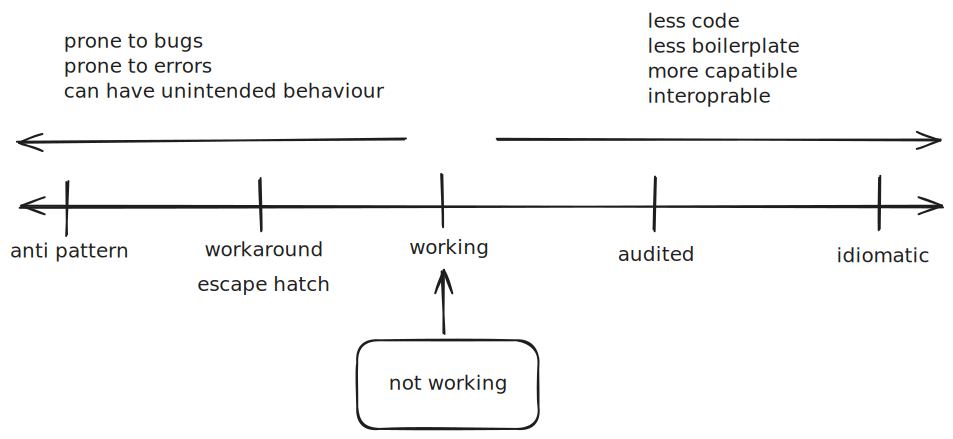

## Idiomatic

follow all best practices of the language/context

## Audited

same as working code, but has been audited to avoid antipatterns

## Working

code that works , no evalution has been placed on it

## Escape hatch

ideal code not possible due to incompatilibities during integration. The limitation is enforced by Svelte is by design.

## Workaround

ideal code is not possible due to bug or limitation. The limitation is not enforced by design.

## Anti-pattern

Code that works, but can lead to unintended results
