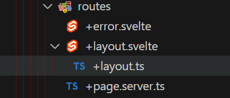

This page aims to gather all resources related to `Svelte` and `VS Code`.

## Install The Official Extension

https://marketplace.visualstudio.com/items?itemName=svelte.svelte-vscode

## Enable File Nesting



Keep your `Explorer View` compact by nesting related files together.

```json [settings.json]
{
	"explorer.fileNesting.enabled": true,
	"explorer.fileNesting.expand": false,
	"explorer.fileNesting.patterns": {
		"+layout.svelte": "+layout.server.ts,+layout.server.js,+layout.ts,+layout.js,+layout.gql",
		"+page.svelte": "+page.server.ts,+page.server.js,+page.ts,+page.js,+page.gql"
	}
}
```

- https://code.visualstudio.com/updates/v1_67#_explorer-file-nesting
- https://github.com/antfu/vscode-file-nesting-config

## Put Files First

Since Sveltekit uses a [filesystem-based router](https://svelte.dev/docs/kit/routing), placing files first keeps related items grouped together within their folder.

```json [settings.json]
{
	"explorer.sortOrder": "filesFirst"
}
```

## Custom File labels

Sveltekit's [filesystem-based router](https://svelte.dev/docs/kit/routing) gives every file the same name. Which can be difficult to distinguish when multiple are open. VSCode's custom label feature can help clear this up. Open `.vscode/settings.json` and add the following.

```json [settings.json]
{
	"workbench.editor.customLabels.patterns": {
		// Page
		"**/routes/**/*/+page.svelte": "${dirname} ❱ page",
		"**/routes/+page.svelte": "/ ❱ page",
		// Layout
		"**/routes/**/*/+layout.svelte": "${dirname} ❱ layout",
		"**/routes/+layout.svelte": "/ ❱ layout",
		// Page Data
		"**/routes/**/*/+page.[tj]s": "${dirname} ❱ page",
		"**/routes/+page.[tj]s": "/ ❱ page",
		// Layout Data
		"**/routes/**/*/+layout.[tj]s": "${dirname} ❱ layout",
		"**/routes/+layout.[tj]s": "/ ❱ layout",
		// Page Server Data
		"**/routes/**/*/+page.server.[tj]s": "${dirname} ❱ page.server",
		"**/routes/+page.server.[tj]s": "/ ❱ page.server",
		// Page Layout Data
		"**/routes/**/*/+layout.server.[tj]s": "${dirname} ❱ layout.server",
		"**/routes/+layout.server.[tj]s": "/ ❱ layout.server",
		// Error Page
		"**/routes/**/*/+error.svelte": "${dirname} ❱ error",
		"**/routes/+error.svelte": "/ ❱ error",
		// API Endpoint
		"**/routes/**/*/+server.[tj]s": "${dirname} ❱ API",
		"**/routes/+server.[tj]s": "/ ❱ API"
	}
}
```

## Breakpoint Debugging

https://svelte.dev/docs/kit/debugging#Visual-Studio-Code
