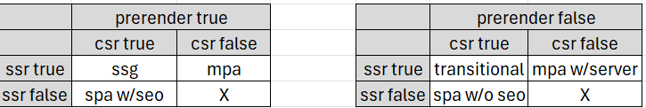

## Reference

- https://web.dev/articles/rendering-on-the-web#conclusion - Has a good graphic summarizing this topic
- https://dev.to/mandrasch/rich-harris-explains-why-sveltekit-pushes-for-server-side-rendering-and-against-spa-5flj - Why is SSR better for the web
- https://svelte.dev/docs/kit/page-options - sveltekit options
- https://svelte.dev/docs/kit/glossary - Svelte team's definitions
