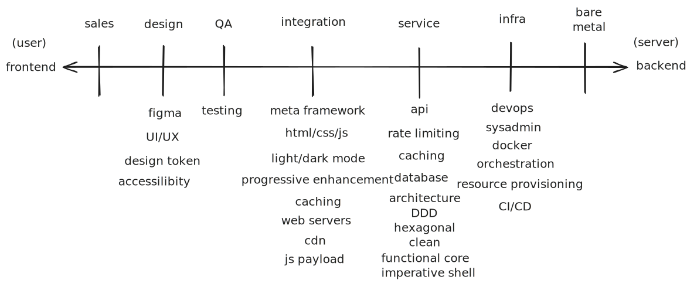

The word full-stack lacks naunace and descriptiveness. As meta-frameworks become more popular other words like front-frontend and front-backend came into circulation. More and more, frontend devs find themselves working on projects and tasks they have no expertise in. In the graph above, I attempt to provide a visualization and a language to give power back to devs to communicate what it is exactly that they do.

