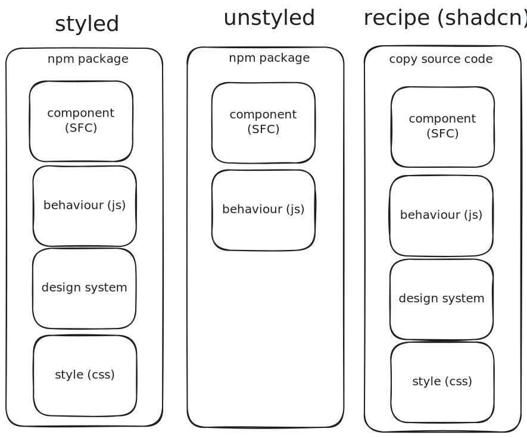
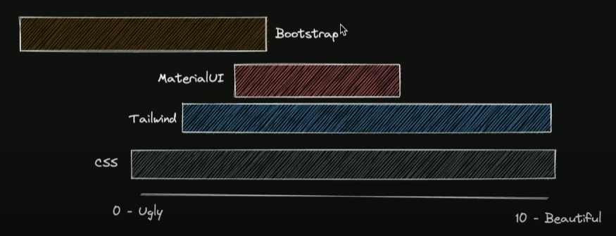

UI Component libraries has good through many evolutions, this aims to breakdown the major points where improvements were made and what tradoffs they entail

Each library often fall into 1 or more categories, and there is a lot of cross Pollination (see shadcn or base-ui). The lists below simpler offer examples which fall into the category, not suggesting they are exclusive to that category.

Another problem in this space is that everything shares similiar names, Like wikipedia, I will do my best to disambiguate and call them out when needed.

## Styling

Each library provides a way for you to customize their styles, either by providing an proprierty api or a way to inject css

### via Props

comes with props that allow you to defined a style. (example vuetify)

### via CSS Hooks

This can come in the form of overwriting classes or variables (bootstrap),

### via Hard overwride

When the options arent built into the library, you inspect its internal api and overwrite it with css `!important`.

## CSS Framework

A css framework is often used to manage the css

- tailwind
- unocss
- picocss
- postcss
- scss
- sass

## Component Type



The why they're setup has changes over time to address certain problems.

This list is ordered from the most opinioned to least optionated. Another way to look at it is that it gets progressively harder to use, but more powerful.

### Styled

Not be be confused with [styled-components](https://styled-components.com/)--A css-in-js react ui library-- Styled compoments are plug and play components. Usually bundled together as a package on `npm` to easily install.


src https://youtu.be/CQuTF-bkOgc?t=784

#### Examples

- [MUI](https://mui.com/) react material
- [Vuetify](https://vuetifyjs.com/) vue material
- [Chakra UI](https://chakra-ui.com/)
- Mantime
- skeleton ui V2

#### Pros

- Plug and play
- fast prototyping
- Beginner Friendly
- CSS knowledge minimal

#### Cons

- limited customization
- locked into a framework or worse, library

### Unstyled

Lets the developer own the UI. the primary goal is to provide behaviour as well as accessability, cross browser compatibility, and progressive enhancement. Libraries in this category also tend to specialize on specific component (command, data table, carassell).

[Web Dev Simplified's Introduction to unstyled libraries](https://youtu.be/yn6vFCRkC3c)

Since there are no styles, it can be turn a off to those are less articstically inclined, so these libraries often include default styles based on popular existing design systems or build one in-house.

#### via hook API (JS)

Uses JS syntax.

- melt ui

#### via Componenent API (HTML + JS)

make use of the single file component (SFC) synax provided by the js framework. Common pattern looks like below

```jsx
import { Input } from '@headlessui/react'

function Example() {
	return <Input type="text" name="full_name" className="border data-[hover]:shadow data-[focus]:bg-blue-100" />
}
```

- [Radix UI](https://www.radix-ui.com/) react custom
- [HeadlessUI](https://headlessui.com/)
- [React Aria](https://react-spectrum.adobe.com/)
- bits ui

#### Pros

- Good for designers who prefer to focus on the look over the behaviour.

#### Cons

- limited component selection
- can feel incomplete when default styles are not provided

### Recipe

There are intended to copy and paste straight into your codebase. With little or no dependnecies needed. All depedencies are in-house.

- daisyUI
- open props
- preline
- [Pico CSS](https://picocss.com/)
- flowbite
- TailwindUI
- skeleton ui V3

#### Shadcn

Shadcn is by far the most popular recipe to build off of. They have pioneered in this space.
By not including a dependency for themself, that allowed/encouraged other devs to build off of their library

Instead of asking you to install your component library as a dependency, it provides the dev with the source often accompanied by a CLI to copy to your project. It often makes use of existing headless libraries and css frameworks. They are so popular that new UI libraries often use shadcn as it's foundation to springboard their own product.

Checkout this [article](https://manupa.dev/blog/anatomy-of-shadcn-ui) for a deeper dive.

#### Pros

- plug and play
- full-control over design and behaviour

#### Cons

- hard to update (responsible of merging your changes with upstream, especially painful for major releasing involving breaking changes)
- hard to modify for beginners

#### Examples

- [Shadcn UI](https://ui.shadcn.com/)
- [Shadcn-Svelte](https://www.shadcn-svelte.com/)
  - https://aceternity.sveltekit.io/
  - https://animation-svelte.vercel.app/
- flowbite
- daisyui

## Design System

How can you tell when something is a design system or not? A quick and dirty method is to see if it provides a colour pallete. If so, there's a good chance it is a design system.

- [Apple - HIG](https://developer.apple.com/design/human-interface-guidelines)
- [Google - Material 3](https://m3.material.io/)
- [Microsoft - Fluent 2](https://fluent2.microsoft.design/)
- [Vercel - Geist](https://vercel.com/design)
- [UK - GOV.UK](https://design-system.service.gov.uk/get-started/)
- [Tailwind - in-house](https://www.refactoringui.com/) [src](https://www.youtube.com/watch?v=ZuLn42merAg)
- [Bootstrap - in-house](https://getbootstrap.com/)

## Storybook

If you're serious about UI, Storybook (and its sister service, chromatic) is a must. It is essentially unit testing for UI. Protects against regression.

# References

- https://prismic.io/blog/react-component-libraries#radix-ui
- https://www.youtube.com/watch?v=qyG-xWjNZKU
